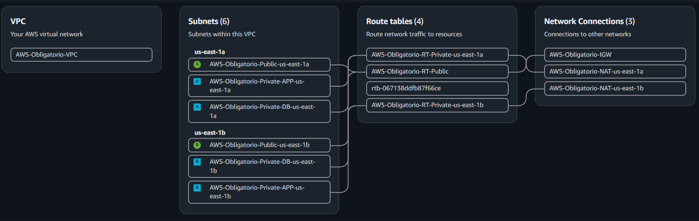

🌐 module-networking
Repositorio: `ISC-2026-Martinez-Ourthe-Cabale/module-networking`  
Lenguaje: HCL (Terraform)
## Descripción
Crea y configura toda la capa de red de la infraestructura sobre AWS. Incluye la VPC, subnets públicas y privadas (en múltiples AZs), Internet Gateway, NAT Gateways con Elastic IPs y las tablas de ruteo asociadas.

## Diagrama de VPC



## Recursos Creados

| Recurso AWS | Cantidad | Descripción |
|-------------|----------|-------------|
| `aws_vpc` | `1` | VPC principal con DNS habilitado |
| `aws_internet_gateway` | `1` | Internet Gateway para salida a Internet desde subnets públicas |
| `aws_subnet` (pública) | `N` (una por AZ) | Subnets públicas para ALB y NAT Gateway, con `map_public_ip_on_launch = true` |
| `aws_subnet` (privada APP) | `N` (una por AZ) | Subnets privadas para instancias EC2 |
| `aws_subnet` (privada DB) | `N` (una por AZ) | Subnets privadas para la base de datos RDS |
| `aws_eip` | `N` (una por AZ) | Elastic IPs para los NAT Gateways |
| `aws_nat_gateway` | `N` (una por AZ) | NAT Gateways desplegados en subnets públicas para proporcionar salida a Internet a las subnets privadas |
| `aws_route_table` (pública) | `1` | Tabla de rutas pública con la ruta `0.0.0.0/0 → IGW` |
| `aws_route_table` (privada) | `N` (una por AZ) | Tablas de rutas privadas con la ruta `0.0.0.0/0 → NAT GW` |
| `aws_route_table_association` | `N×3` | Asociaciones entre route tables y subnets |
## Variables de entrada
## Variables de Entrada

| Variable | Tipo | Requerida | Descripción |
|----------|------|:---------:|-------------|
| `vpc_cidr` | `string` | ✅ | CIDR block principal de la VPC |
| `name` | `string` | ❌ | Nombre del proyecto para taggear recursos. Default: `"Obligatorio"` |
| `azs` | `list(string)` | ✅ | Lista de Availability Zones (ej: `["us-east-1a", "us-east-1b"]`) |
| `public_subnet_cidrs` | `list(string)` | ✅ | CIDRs de las subnets públicas (uno por AZ) |
| `private_app_subnet_cidrs` | `list(string)` | ✅ | CIDRs de las subnets privadas de aplicación (uno por AZ) |
| `private_db_subnet_cidrs` | `list(string)` | ✅ | CIDRs de las subnets privadas de base de datos (uno por AZ) |

## Outputs

| Output | Descripción |
|---------|-------------|
| `vpc_id` | ID de la VPC creada |
| `public_subnet_ids` | Lista de IDs de subnets públicas |
| `private_app_subnet_ids` | Lista de IDs de subnets privadas de APP |
| `private_db_subnet_ids` | Lista de IDs de subnets privadas de DB |
| `nat_gateway_ids` | Lista de IDs de los NAT Gateways (uno por AZ) |

## Uso como módulo
```hcl
module "networking" {
  source = "git::ssh://git@github.com/ISC-2026-Martinez-Ourthe-Cabale/module-networking.git"

  vpc_cidr                 = "10.0.0.0/16"
  name                     = "Obligatorio"
  azs                      = ["us-east-1a", "us-east-1b"]
  public_subnet_cidrs      = ["10.0.1.0/24", "10.0.2.0/24"]
  private_app_subnet_cidrs = ["10.0.10.0/24", "10.0.11.0/24"]
  private_db_subnet_cidrs  = ["10.0.20.0/24", "10.0.21.0/24"]
}
```
## Notas
>Se crea un NAT Gateway por AZ para garantizar alta disponibilidad en la salida a Internet de las subnets privadas.
Las subnets públicas tienen `map_public_ip_on_launch = true`, apropiado para el ALB.
Los recursos de red son la base para todos los demás módulos; debe desplegarse primero o como dependencia.
---

